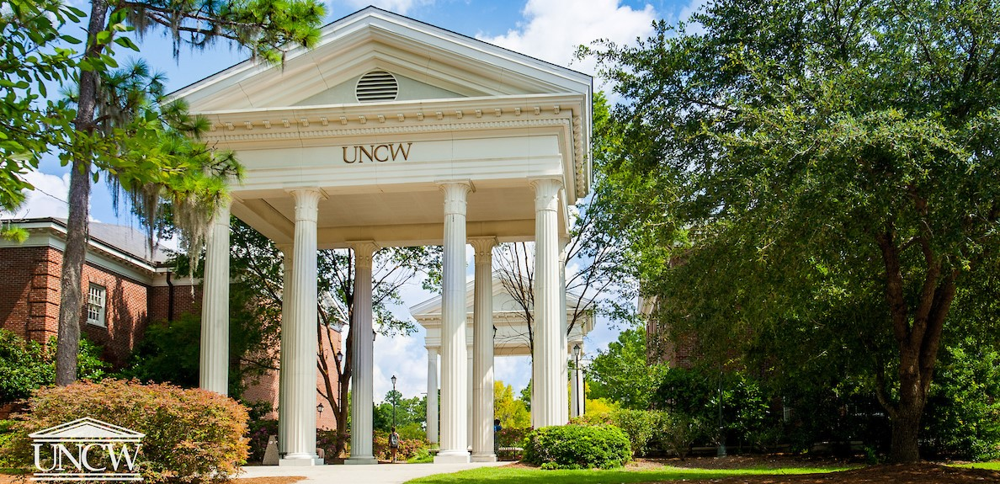

Welcome! I am an Associate Professor in International Relations in the [Public and International Affairs](//https://uncw.edu/pia/) at the [University of North Carolina Wilmington](https://www.uncw.edu/). My research and teaching interests lie at the intersection of International Relations and Comparative Politics, focusing on global security and post-conflict peace building. If you have any questions or if you want to reach out to me, please email me at phayala@uncw.edu.

<!-- Google tag (gtag.js) -->

